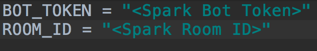

# SB_Runscope2Spark
Forwards Alert requests from RunScope to Spark

## Purpose

This application is a simple Runscope Alert / [Cisco Spark](https://developer.ciscospark.com/) Bot App built in Python [Flask](http://flask.pocoo.org/). This app is meant to be deployed to AWS Lambda to be served serverlessly using the [Zappa Framework](https://github.com/Miserlou/Zappa)

## Pre-Requirements

* [git](https://git-scm.com/downloads) on your computer
* [Python 3.6+](https://www.python.org/downloads/)
* Runscope.com account
> Runscope is a service that allows you monitor and test your APIs from an outsider perspective
* Some knowledge of Python
* Cisco Spark Developer Account and a Bot token.
* AWS CLI and AWS creds - `pip install awscli --upgrade --user`
> Use the following guide to configure your [AWS CLI](http://docs.aws.amazon.com/cli/latest/userguide/cli-chap-getting-started.html).
* Zappa - `pip install zappa`
* VirtualEnv - `pip install virtualenv`

## Up and running QUICKLY!!!

1. From your commmand line, Clone this repo and enter directory!

```
$ git clone https://github.com/CiscoDevNet/SB_Runscope2Spark \
&& cd SB_Runscope2Spark
```
2. Create your virtualenv
```
$ virtualenv -p python3 <name your project>

or

$ virtualenv -p python3.6 <name your project>
```

3. enter your virtualenv

```
$ source <name your project>/bin/activate
```

4. Install your dependencies using the requirement.txt file in this directory.

```
$ pip install -r requirements.txt
```

5. Update the config.py file in this same directory with your Cisco Spark bot token and the room ID for the Spark space you have made available for this project.




6. Initalize your Zappa environment and follow the directions (example output below).

```
$ zappa init
```

> Note: When the instructions ask if you want to deploy globally, enter 'n' for no.

7. Deploy your application to Lambda

```
$ zappa deploy dev
```


8. Copy the URL that is provided by zappa and add to your Runscope bucket alerts under the web hooks section.
 
 

9. Trigger a false alert to see the result on your Spark messenger

10. Pat yourself on the back for deploying a serverless Cisco Spark Bot!


